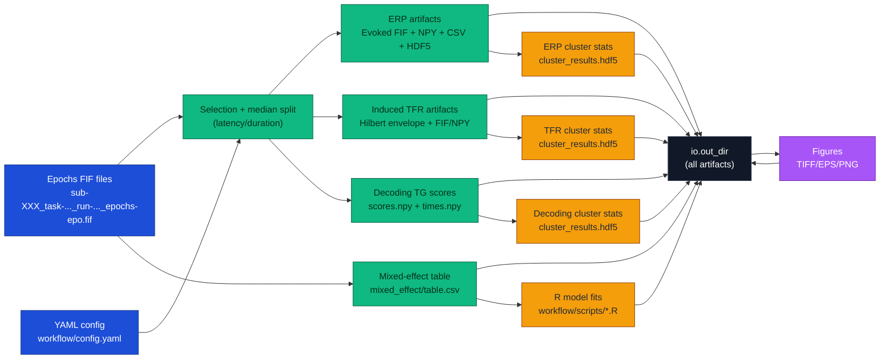

# turntaking

Turn-taking analysis pipeline for conversational EEG (MNE-Python).

This repository runs a reproducible, file-based workflow on *already-epoched*
MNE ``Epochs`` FIF files. It produces:

- ERP artifacts (per contrast) + summary tables
- induced TFR (Hilbert envelope) artifacts (per contrast x band)
- temporal-generalization decoding scores (per contrast)
- cluster permutation statistics (ERP/TFR/decoding)
- trial-level mixed-effect tables (CSV) for downstream R models
- publication-ready figures (TIFF/EPS/PNG)

The workflow is designed to be driven either by:

- a Python API (``turntaking.analysis`` and ``turntaking.viz``), or
- the CLI + Snakemake pipeline (``python -m turntaking.cli.main ...`` and ``workflow/Snakefile``)

## What The Codebase Does

At a high level:

1. Discover epochs on disk using ``io.epoch_dir`` + ``io.epoch_pattern``.
2. Select epochs by metadata thresholds (e.g. latency and response duration).
3. Create two-class contrasts by median split:
   - ``duration``: long vs short (split on ``self_duration``)
   - ``latency``: fast vs slow (split on ``latency``)
4. Compute domain-specific artifacts:
   - ERP: trial averages and difference waves
   - TFR: band-pass + Hilbert envelope, averaged per condition and contrasted
   - decoding: temporal generalization scores (train time x test time)
5. Run group statistics (cluster permutation tests) on difference waves/scores.
6. Assemble figures from the saved artifact contracts.

## Final Outputs (What You Get)

The canonical output root is ``io.out_dir`` (see ``workflow/config.yaml``).
The pipeline writes structured artifacts under that directory:

- ``erp/<contrast>/``
  - ``difference_ave.fif`` and condition FIFs (e.g. ``long_ave.fif``)
  - ``evoked-data.npy`` (stacked per-subject evoked arrays)
  - ``n_trials.csv`` and ``offsets.csv`` (trial accounting + per-epoch metadata)
  - ``metadata.hdf5`` (small metadata payload used by downstream steps)
- ``tfr/<contrast>/<band>/``
  - ``difference_ave.fif`` and condition FIFs
  - ``induced-data.npy`` (stacked induced envelope arrays)
  - ``n_trials.csv`` and ``metadata.hdf5``
- ``decoding/erp/<contrast>/``
  - ``scores.npy`` (``n_subjects x n_splits x n_times x n_times``)
  - ``times.npy`` (``n_times,`` seconds)
- ``stats/``
  - ``stats/erp/<contrast>/cluster_results.hdf5`` + ``cluster_summary.csv``
  - ``stats/tfr/<contrast>/<band>/cluster_results.hdf5`` + ``cluster_summary.csv``
  - ``stats/decoding/erp/<contrast>/cluster_results.hdf5`` + ``cluster_summary.csv``
- ``mixed_effect/``
  - ``mixed_effect/table.csv`` (trial-level table for R mixed-effect models)
  - additional model outputs produced by ``workflow/scripts/*.R``
- ``figures/``
  - ``figures/main/*.tif|.eps|.png`` (main figures)
  - ``figures/supp/*.tif|.eps|.png`` (supplementary figures)

## Structure (Where Things Live)

- ``src/turntaking/cli/``
  - CLI parsing + dispatch only (thin wrappers around library entrypoints).
- ``src/turntaking/config/``
  - Typed config schema (``TurntakingConfig``) and loader.
- ``src/turntaking/analysis/``
  - Domain logic + artifact contracts:
    - ``analysis/erp``: ERP core + I/O contract
    - ``analysis/tfr``: induced TFR core + I/O contract
    - ``analysis/decoding``: dataset construction, decoding runner, I/O contract
    - ``analysis/mixed_effect``: trial-level table generation for R
    - ``analysis/cluster``: cluster-test orchestration for ERP/TFR
- ``src/turntaking/viz/``
  - Figure rendering from saved artifacts (static and SVG-based compositions).
- ``workflow/``
  - Snakemake pipeline wiring + example config + manuscript-style targets.

## Pipeline Diagram



## Quickstart

### 1) Install

From the repo root:

```bash
python -m pip install -e .
```

### 2) Configure

Edit ``workflow/config.yaml`` to point at your epochs and desired output directory.

Critical assumptions about input epochs:

- they are MNE epochs FIF files
- filenames match ``io.epoch_pattern``
- ``epochs.metadata`` includes at least:
  - ``latency`` (float seconds)
  - ``self_duration`` (float seconds)

### 3) Run (CLI)

Run the grouped analysis targets:

```bash
python -m turntaking.cli.main analyze --config workflow/config.yaml all
```

Or run a single domain:

```bash
python -m turntaking.cli.main analyze --config workflow/config.yaml erp
python -m turntaking.cli.main analyze --config workflow/config.yaml tfr
python -m turntaking.cli.main analyze --config workflow/config.yaml decoding --contrast duration
python -m turntaking.cli.main analyze --config workflow/config.yaml mixed
```

### 4) Run (Snakemake)

The Snakemake workflow wires analysis -> stats -> figures:

```bash
snakemake -s workflow/Snakefile -j 1
```

## Configuration Notes

The typed schema is defined in ``src/turntaking/config/analysis_schema.py`` and
loaded via ``turntaking.config.loader.load_config``.

The main sections are:

- ``io``: epoch discovery + output root
- ``dataset``: subjects/tasks/runs expansion
- ``constraints``: global selection thresholds
- ``analysis``: per-domain parameters (ERP/TFR/decoding/mixed)
- ``viz``: figure input/output paths and render parameters

## Documentation (Sphinx)

This repo includes a Sphinx scaffold under ``docs/`` that builds an API
reference from docstrings.

Typical local build:

```bash
python -m pip install -e .[docs]
cd docs
make html
```
